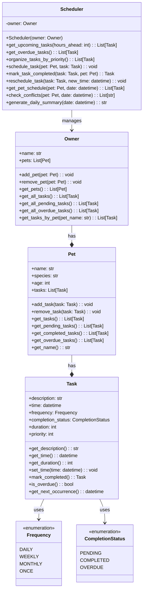
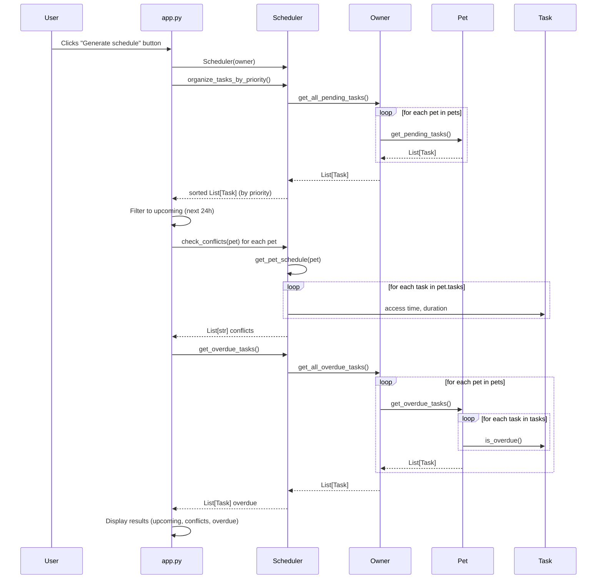

# Updated UML Diagrams for PawPal System

## Class Diagram (Static Structure)

```mermaid
classDiagram
    class Frequency {
        <<enumeration>>
        DAILY
        WEEKLY
        MONTHLY
        ONCE
    }

    class CompletionStatus {
        <<enumeration>>
        PENDING
        COMPLETED
        OVERDUE
    }

    class Task {
        +description: str
        +time: datetime
        +frequency: Frequency
        +completion_status: CompletionStatus
        +duration: int
        +priority: int
        +get_description(): str
        +get_time(): datetime
        +get_duration(): int
        +set_time(time: datetime): void
        +mark_completed(): Task
        +is_overdue(): bool
        +get_next_occurrence(): datetime
    }

    class Pet {
        +name: str
        +species: str
        +age: int
        +tasks: List[Task]
        +add_task(task: Task): void
        +remove_task(task: Task): void
        +get_tasks(): List[Task]
        +get_pending_tasks(): List[Task]
        +get_completed_tasks(): List[Task]
        +get_overdue_tasks(): List[Task]
        +get_name(): str
    }

    class Owner {
        +name: str
        +pets: List[Pet]
        +add_pet(pet: Pet): void
        +remove_pet(pet: Pet): void
        +get_pets(): List[Pet]
        +get_all_tasks(): List[Task]
        +get_all_pending_tasks(): List[Task]
        +get_all_overdue_tasks(): List[Task]
        +get_tasks_by_pet(pet_name: str): List[Task]
    }

    class Scheduler {
        -owner: Owner
        +Scheduler(owner: Owner)
        +get_upcoming_tasks(hours_ahead: int): List[Task]
        +get_overdue_tasks(): List[Task]
        +organize_tasks_by_priority(): List[Task]
        +schedule_task(pet: Pet, task: Task): void
        +mark_task_completed(task: Task, pet: Pet): Task
        +reschedule_task(task: Task, new_time: datetime): void
        +get_pet_schedule(pet: Pet, date: datetime): List[Task]
        +check_conflicts(pet: Pet, date: datetime): List[str]
        +generate_daily_summary(date: datetime): str
    }

    Owner --* Pet : has
    Pet --* Task : has
    Scheduler --> Owner : manages
    Task --> Frequency : uses
    Task --> CompletionStatus : uses
```

## Sequence Diagram (Dynamic Interactions for Generate Schedule)

```mermaid
sequenceDiagram
    participant User
    participant App as app.py
    participant Scheduler
    participant Owner
    participant Pet
    participant Task

    User->>App: Clicks "Generate schedule" button
    App->>Scheduler: Scheduler(owner)
    App->>Scheduler: organize_tasks_by_priority()
    Scheduler->>Owner: get_all_pending_tasks()
    loop for each pet in pets
        Owner->>Pet: get_pending_tasks()
        Pet-->>Owner: List[Task]
    end
    Owner-->>Scheduler: List[Task]
    Scheduler-->>App: sorted List[Task] (by priority)
    App->>App: Filter to upcoming (next 24h)
    App->>Scheduler: check_conflicts(pet) for each pet
    Scheduler->>Scheduler: get_pet_schedule(pet)
    loop for each task in pet.tasks
        Scheduler->>Task: access time, duration
    end
    Scheduler-->>App: List[str] conflicts
    App->>Scheduler: get_overdue_tasks()
    Scheduler->>Owner: get_all_overdue_tasks()
    loop for each pet in pets
        Owner->>Pet: get_overdue_tasks()
        loop for each task in tasks
            Pet->>Task: is_overdue()
        end
        Pet-->>Owner: List[Task]
    end
    Owner-->>Scheduler: List[Task]
    Scheduler-->>App: List[Task] overdue
    App->>App: Display results (upcoming, conflicts, overdue)
```